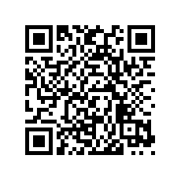

# Unlock PC From iPhone
Unlocking your PC requires setup on both the target computer and downloading the Siri Shortcuts onto your device (the latter is easy, the former is harder)<br/> 
Furthermore, there are a few prerequisites to getting this working: If you don't have these ready, **it will not work**.
1. Windows 7/8/10 Professional. Home users are out of luck because Remote Desktop isn't available. 
2. OpenSSH Server (or alternative) must be installed on your computer and the service must be running (Follow [this tutorial](https://winaero.com/blog/enable-openssh-server-windows-10/))
3. An account with Admin rights

**Warnings**
--
**Your mileage may vary. A lot**

The way this works is the computer sets up a remote connection to itself (which locks you out), then passes control of the session back to you after a short delay (which *should* log you in). However this isn't a stable solution and the following issues may occur. None of these are permanent, and control of the computer should resume normally after a minute or two in the worst case scenario. 
* The Lock screen blinks and doesn't log you in
* The screen goes black and the computer cannot be controlled (for up to a minute or two, then it should unlock anyway) 
* You cannot login and receive a message telling you to wait a few minutes - so wait a few minutes.
* The screen stays at "Please Wait" with a spinning circle. 

I don't know why, but the success rate drops the longer the computer is running. Success rates range from 100% after a restart to ~20% after several lock/unlock cycles. 

# Setting up the PC - Easy
Download the helper program to set everything up automatically. 
Note that you will still need to set up the SSH Server manually if you haven't already done so above. 

# Setting up the PC - Manually

### 1. Download the files
Download `UnlockWindows.bat` and `UnlockWindows_rdp.ps1` files and place them together in `C:/SSH`
### 2. Add your username and password to `UnlockWindows_rdp.ps1`
The file should look like this: 
```ps1
$Server="127.0.0.2"
$User="`"John`""
$Password="`"hunter2`""
cmdkey /generic:TERMSRV/$Server /user:$User /pass:$Password
mstsc /v:$Server
```

**Note**: Obviously this is a potential security risk as your windows password is stored in plain text. Technically you can delete the middle 3 lines after the first successful run, but you might run into issues later. 

### 3. Creating the Scheduled Tasks
###### Unfortunately, you can't directly run files over SSH, as security restrictions prevent the remote console space from interacting with the user space. So, aside from using something like PSExec, you need to set up tasks in the Task Scheduler that can be run later. 

There are two tasks that need to be set up:
1. A task to run the remote desktop client (that starts up the `UnlockWindows_rdp.ps1` script above), which is what we'll be triggering from Siri Shortcuts
2. A task that is responsible for actually unlocking the computer, which triggers automatically. 

To start, open `Windows Task Scheduler` and then under `Task Scheduler Library` Make a new folder called `SSHTasks`
<details>
 <summary>Click to see Image</summary>
  


</details>
</br>
Then follow the below steps for Task 1 and Task 2. 
</br>

<details><summary>Task 1 (Click to Expand)</summary>
<p>

1. Create a new Task (**Not** a Basic Task)
2. Set the `General` Tab as shown below

3. Leave the `Triggers` Tab blank
4. Under the `Actions` Tab set it up as such

5. Untick everything in the `Conditions` Tab
6. Set the `Settings` Tab as shown below.

7. Save the task. It should prompt you to enter your password. Then go ahead and create Task 2
</p>
</details>
</br>
<details><summary>Task 2 (Click to Expand)</summary>
<p>

1. Create a new Task (**Not** a Basic Task)
2. Set the `General` Tab as shown below

3. Set up a `Trigger` as shown below. 

4. Under the `Actions` Tab set it up as such

5. Untick everything in the `Conditions` Tab
6. Set the `Settings` Tab as shown below.

7. Save the task. It should prompt you to enter your password. You should now be done making the tasks. 
</p>
</details>

### 4. Testing it out
Hopefully everything is set up properly at this point. Check the `C://SSH` folder and make sure the two files are in there. 

**First, restart your computer and log in**

**Be Warned! The next step can lead to you being locked out for a few minutes if it doesn't work. Don't panic if it does, just be patient and it should unlock or let you enter your password eventually.**

Go ahead and right click the first task in Task Scheduler, and click `Run`. 

<details>
 <summary>Click to see Image</summary>
  


</details>

With some luck, your PC should lock, then flicker and take you straight back to your desktop.

* If it worked perfectly, you can set up the phone shortcuts now. 
* If it did something, but didn't take you back to the desktop as it should have:
  * If you logged in and saw a command prompt window or an error messagebox, it means the second task didn't work properly. Check the troubleshooting section below
  * If you *don't* see a command prompt window/error message box, it means everything *technically* worked fine. Restart your computer and try again. 


# Setting up iPhone Shortcuts

This is the easy part: install these two shortcuts from your phone (scan the QR codes for easy install). Set up the SSH Base Module with your computer's connection info, then run the `Unlock PC` shortcut. 

|[SSH Base Module](https://www.icloud.com/shortcuts/21d139d065b9464a8f6aa3764a02157b)|[SSH Unlock PC](https://www.icloud.com/shortcuts/4da94fefa30b46aeb561a683afa3221e)|
| ------------- | ------------- |
|||


**If you used the Helper program, it will show you the QR codes on the end screen as well as the correct IP address + User/Password information.**


